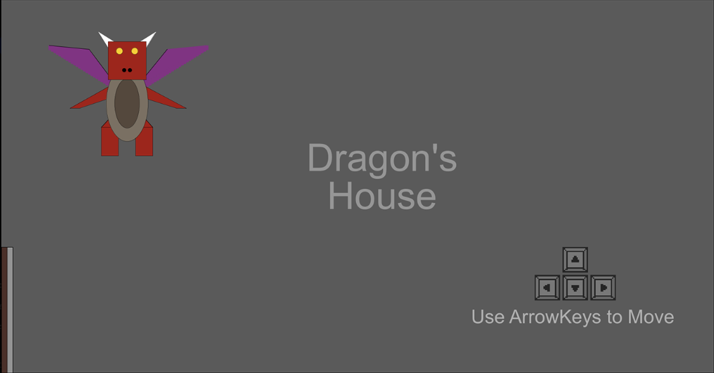
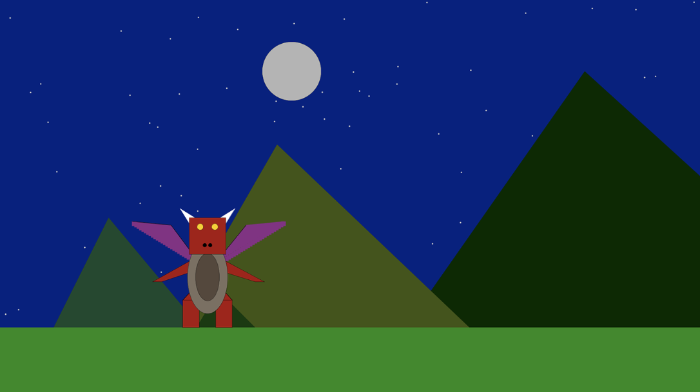
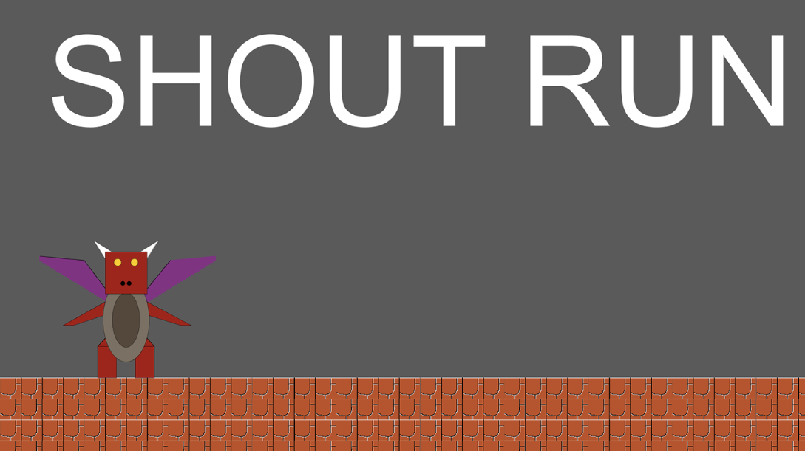
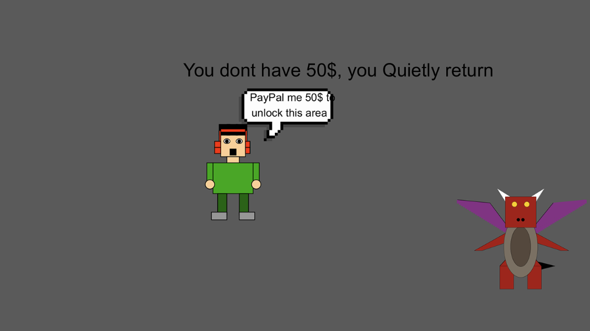
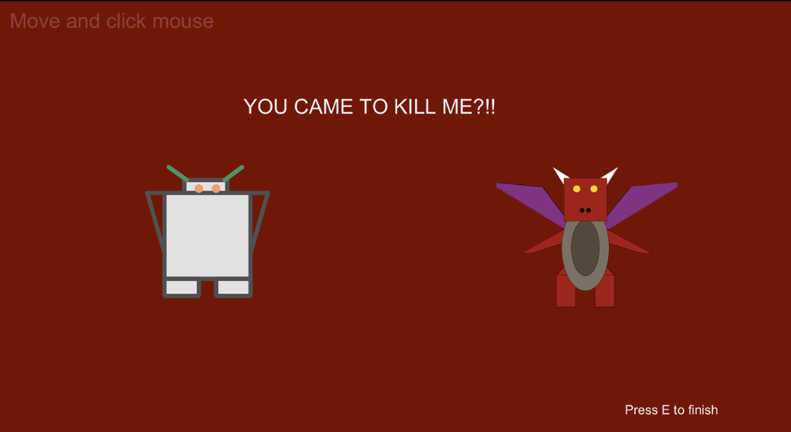

### A Processing 8-bit Game

A small project that helped me learn Processing or P5js a java based GUI library

<li> Pixel Graphics
<li> Chiptune Music
<li> Kickass Lore

#### Preview

<i>The goal here was to create multiple rooms each having its own uniqueness by using the simplest of code</i>

  

<i>There was also an additional constraint that the assets used in the game must be created in processing as well</i>

  

<i>This Room required the usage of Mic, in an attempt to make the game more interactive.</i>

  

<i>"Use what you have, Do what you can"</i>

<i>Some gags</i>

  

<i>And as promised, a beautiful story (it gets good I swear!)</i>

  

#### Original Concept & Proposition

The game from the a coding point of view this game will have one character moving around in a screen and if you reach a certain point let’s say (a door) you will be moved to a new screen or the screen will be simply reset, the result would be you entering another room. And meet new characters or what we call NPC (non-playable character).\
The plan is to let the characters be an assortment of my peer’s code's, in the event that I am all alone, the characters shall be created from the start. All of these elements will be used to make battle scenes and also somehow craft a story. The typical, old-school, retro RPG game.\

The setting can be the classic "Save the princess" scenario or completely gladiator style which revolves around beating people up. The game will at least be 60% text based with dialogues that contain as much humor as possible or make you completely cringe with extremely cliche lines albeit will be interactive. The battle part will be a game of dodging fireballs, which will be fired by the evil boss which happens to be "you" and a non player character who is attempting to dodge it or vice versa. In the event that i want to display extreme creativity the game can be two players.\
\
There is a high chance that it will not be possible to give all my ideas life either because of how difficult it becomes to integrate it or due to my own tardiness but in an ideal situation my program must have all of this.

#### End note
This project can be said to be the culmination of all my Processing knowledge, which of course isn't much. But all the small programs I made in one way or the other helped in creating this.

PS: To me, this project holds some sentimental value. This was a game I made for a college assignment. Is it a really impressive project worth showing off? Probably not. But for an assignment, you could say I went above and beyond. Each room incorporates ideas and programs my peers made, and I wanted it to showcase everyone's creativity.\
Cheers!
